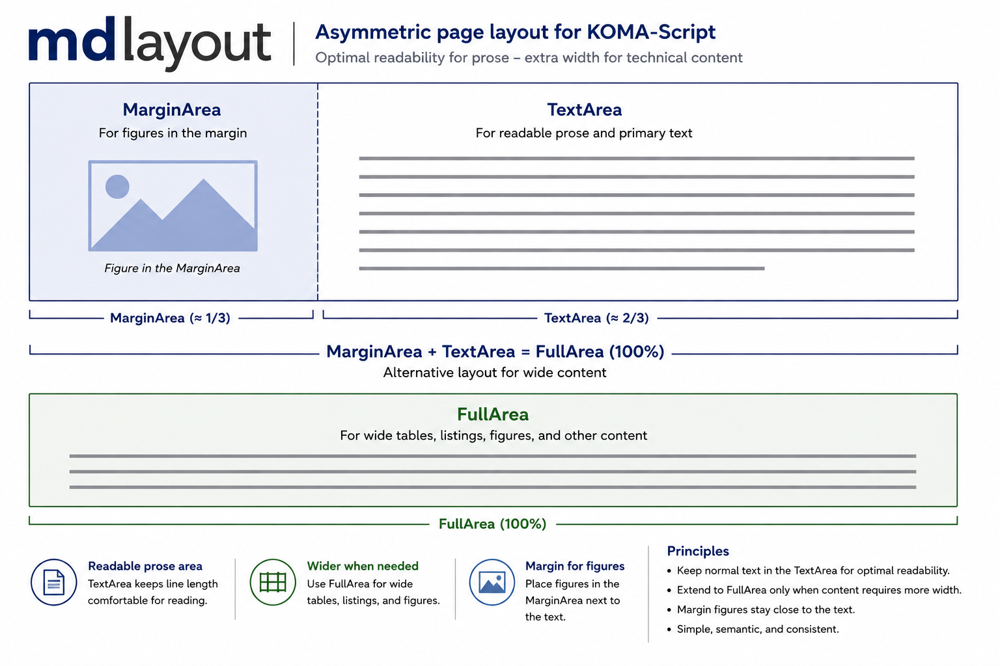

<!--
Copyright 2026 Prof. Dr. Michael Deppe

This work may be distributed and/or modified under the conditions of the
LaTeX Project Public License (LPPL), either version 1.3c or (at your option)
any later version. The work has the LPPL maintenance status `maintained`.
The Current Maintainer is Michael Deppe.
-->

# mdlayout

**A semantic, asymmetric page layout for technical documentation with
LuaLaTeX and KOMA-Script.**

`mdlayout` adds a narrow reading column and explicitly named areas for wide
technical material. Authors describe the purpose of an element—ordinary text,
a margin figure, a reference table, or a machine printout—while the package
handles its placement and typography.



The regular **TextArea** remains comfortable for prose. The additional
**MarginArea** can hold related figures or annotations; together with the
gutter and TextArea it forms the **FullArea**. A **HalfArea** is available for
material that needs an intermediate width.

## Highlights

- `TextArea`, `MarginArea`, `HalfArea`, `FullArea`, and `DirectoryArea`
- synchronized margin and text content, including verbatim material
- non-floating `MarginFigure` objects placed beside the related text
- wide figures, tables, long tables, headings, titles, headers, and footers
- semantic, multipage `ReferenceTable` tables with flexible column counts,
  widths, alignment, and verbatim or typewriter columns
- `Printout` for column-sensitive logs, spool files, terminal sessions, and
  line-printer output
- automatic monospaced font scaling based on the required logical column count
- continuous-paper forms `plain`, `simple`, `green`, `blue`, and
  `ibm1403`, with configurable bands, page lengths, line numbers, and
  tractor-feed holes
- automatic layout adaptation for narrower paper sizes
- shared-source conditionals `\ifPdf` and `\ifHtml`
- companion conversion tools for responsive HTML and editable DOCX output

## Requirements

The LaTeX package requires:

- LuaLaTeX with UTF-8 input
- one of the KOMA-Script classes `scrartcl`, `scrreprt`, or `scrbook`
- a reasonably complete LaTeX installation

Other document classes and `fancyhdr` are not supported. Page headers and
footers use `scrlayer-scrpage`.

For HTML and DOCX conversion, Pandoc 3 or later and Python 3 are required.
Poppler and ImageMagick are optional and are needed only when the converter
must create browser images from PDF graphics for which no matching SVG or WebP
asset is supplied.

On macOS with Homebrew:

```sh
brew install pandoc python
# Optional graphics conversion:
brew install poppler imagemagick
```

On Debian or Ubuntu:

```sh
sudo apt update
sudo apt install pandoc python3
# Optional graphics conversion:
sudo apt install poppler-utils imagemagick
```

## Installation and quick start

Clone the repository:

```sh
git clone https://github.com/michael-deppe/mdlayout.git
cd mdlayout
```

Keep `mdlayout.sty`, `mdlayout-printout.sty`, and
`mdlayout-referencetable.sty` together in the document directory or install
them in a local TeX tree. A minimal document is:

```latex
% !TEX TS-program = lualatex
\documentclass{scrbook}

\usepackage[
  marginwidth=38mm,
  gutter=5mm
]{mdlayout}

\begin{document}

Ordinary prose is set in the TextArea.

\begin{FullArea}
  Wide technical material may use the complete FullArea.
\end{FullArea}

\end{document}
```

Compile it with:

```sh
lualatex document.tex
```

## Reference tables

`ReferenceTable` is the recommended tabular environment for command summaries,
parameter descriptions, option lists, symbol tables, and similar reference
material. It hides the repeated setup normally required for multipage
`xltabular` tables and can combine literal computer text with ordinary LaTeX
content.

```latex
\begin{ReferenceTable}[
  area=half,
  caption={Example Commands},
  label={tab:commands},
  columns=2,
  verbatimcolumn=1,
  xcolumn=2
]{Command}{Function}

NEW  & Creates a new document. \\
SAVE & Saves the current document. \\

\end{ReferenceTable}
```

Traditional `widetable` and `widelongtable` environments remain available
for compatibility when a conventional LaTeX table is preferable.

## Machine printouts

`Printout` preserves spaces, character positions, and line lengths instead of
treating machine-generated output as source code. `fitcolumns` specifies its
logical width; the package reduces the monospaced font only when necessary.

```latex
\begin{Printout}[
  form=ibm1403,
  paperheight=60,
  fitcolumns=132,
  linenumbers=true,
  punchholes=true
]
 _   _ _____ _     _     ___
| | | | ____| |   | |   / _ \
| |_| |  _| | |   | |  | | | |
|  _  | |___| |___| |__| |_| |
|_| |_|_____|_____|_____\___/

\end{Printout}
```

Additional forms can be declared with `\MDDeclarePrintoutForm`.

## Building the documentation

The user guide is itself written with `mdlayout` and serves as a comprehensive
example:

```sh
latexmk -lualatex mdlayout.tex
```

Without `latexmk`, run `lualatex mdlayout.tex` repeatedly as required to
resolve the table of contents, references, and document directories.

## HTML output

Generate a responsive HTML document from the same source with:

```sh
make -f html-build/Makefile html
```

or call the converter explicitly:

```sh
html-build/build-html.sh \
  mdlayout.tex mdlayout.html \
  mdlayout.sty mdpreamble.tex
```

The resulting HTML file contains its stylesheet and webfont. Keep its adjacent
`images` directory when publishing or moving the document. Mathematics is
rendered with MathJax; the `mdlayout` areas become a responsive web layout.

## DOCX output

Generate an editable word-processor document with:

```sh
make -f html-build/Makefile docx
```

or:

```sh
html-build/build-docx.sh \
  mdlayout.tex mdlayout.docx \
  mdlayout.sty mdpreamble.tex
```

The DOCX output is intended for exchanging or reusing individual text passages
in LibreOffice, OpenOffice, Apple Pages, OnlyOffice, or Microsoft Word. It is
not a typographically identical Word edition of the LaTeX PDF: a word
processor has a different layout model, and programs interpret complex tables
and row heights differently.

## Target-specific content

PDF- and HTML-specific passages can coexist in the same source:

```latex
\ifPdf
  Content used only in the PDF build.
\else
  Content used only in the HTML and DOCX builds.
\fi

\ifHtml
  Additional HTML and DOCX content.
\fi
```

Use these conditionals only when content cannot be represented meaningfully in
all output formats.

## Documentation and included files

The complete user guide is generated from `mdlayout.tex` as `mdlayout.pdf`.
The principal distribution files are:

- `mdlayout.sty` — page model and general environments
- `mdlayout-printout.sty` — semantic machine printouts
- `mdlayout-referencetable.sty` — semantic reference tables
- `mdpreamble.tex` — example document preamble
- `mdlayout.tex` — complete user guide and examples
- `html-build/` — HTML and DOCX conversion tools
- `images.pdf` and `mdlayout-images-pages.tex` — named documentation images

## License

Distributed under the LaTeX Project Public License, version 1.3c or later. See
[`LICENSE`](LICENSE) for details.

## Author and maintainer

Prof. Dr. Michael Deppe

Project repository:
[github.com/michael-deppe/mdlayout](https://github.com/michael-deppe/mdlayout)
